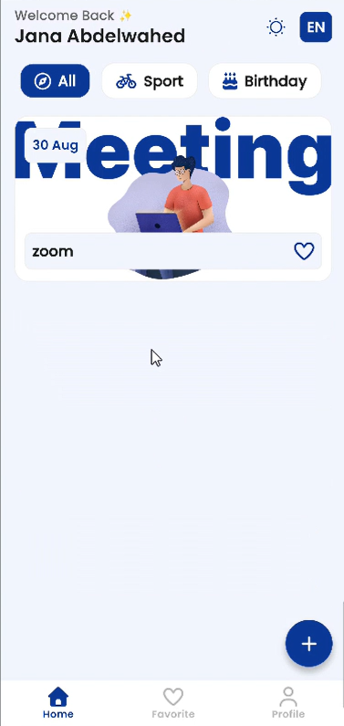
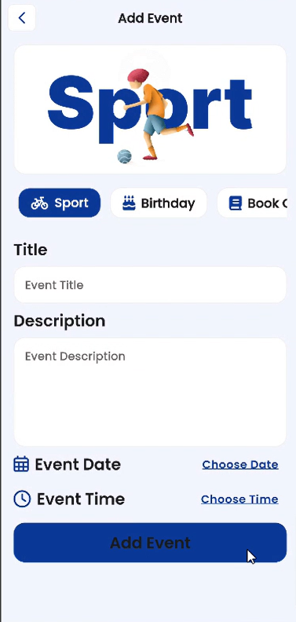
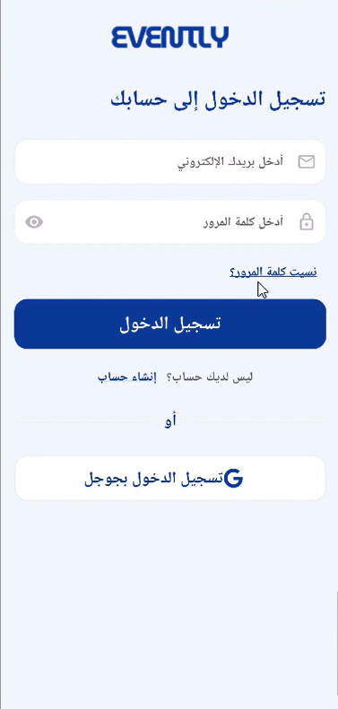
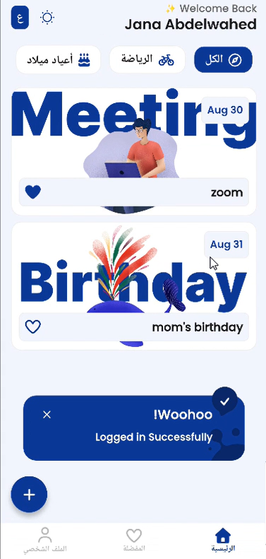

# 📅 Evently - Event Management Application

Evently is a full-featured, cross-platform mobile application built with Flutter and Firebase. It allows users to browse, search, filter, and organize events seamlessly with real-time Firestore synchronization, dynamic internationalization (English & Arabic), and dark/light theme options.

---
## 📸 Screenshots
|  |  |  | |  |
 |  |

---

## ✨ Features

* **Authentication & User Profiles:** Secure account handling via Firebase Authentication.
* **Event Management:** Create, update, and delete events with date/time pickers and custom event categories.
* **Category Filtering:** Filter events by categories (*All, Sport, Birthday, Book Club, Meeting, Exhibition*).
* **Favorites System:** Dynamic favorite toggling synchronized across UI tabs and Firebase Firestore.
* **Localization & Theme:** Built-in support for multi-language localization (EN/AR) and persistent Light/Dark theme switching.

---

## 🛠️ Tech Stack & Packages

* **Framework:** [Flutter](https://flutter.dev/) (Dart)
* **Backend & Auth:** Firebase Cloud Firestore, Firebase Authentication
* **State Management:** Provider
* **Localization:** `flutter_localizations`, `intl`
* **Icons & UI Utilities:** `font_awesome_flutter`, `flutter_svg`, `awesome_snackbar_content`

---

